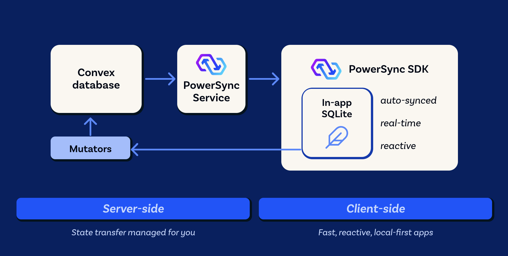

# PowerSync + Convex Demo App

A React todo-list demo that syncs data between Convex and local SQLite via PowerSync. **No separate Node.js backend required** — auth is handled by Convex Auth and mutations are called directly via the Convex client.

## What's Included

### Frontend

- Vite + React with TypeScript
- Material UI for the demo interface
- PowerSync React hooks for local SQLite reads and sync status
- PowerSync Web SDK with WA-SQLite local storage

### Backend

- Self-hosted Convex for schema, auth, and mutations
- Convex Auth with email/password sign-in
- Convex schema validators reused by the PowerSync upload connector for SQLite-to-Convex payload conversion

### Local Development Infrastructure

- Self-hosted PowerSync Service in Docker
- Self-hosted Convex backend and dashboard in Docker
- MongoDB storage for the local PowerSync Service storage
- A local dev script that starts Docker services, extracts the Convex deploy key, configures Convex Auth JWT/JWKS, and then starts Convex, Vite, and a PowerSync config watcher

## Project Structure

```text
demos/react-convex-todolist/
+-- convex/                      # Convex schema, auth, and mutations
|   +-- schema.ts                 # Convex tables for lists, todos, auth, checkpoints
|   +-- lists.ts                  # List mutations called by the PowerSync connector
|   +-- todos.ts                  # Todo mutations called by the PowerSync connector
|   +-- auth.ts                   # Convex Auth configuration
+-- powersync/
|   +-- service.yaml              # Local PowerSync Service configuration
|   +-- sync-config.yaml          # Sync Streams selecting rows from Convex
|   +-- docker/
|       +-- docker-compose.yaml   # Local PowerSync, Convex, dashboard, and Mongo stack
|       +-- modules/              # Compose modules for Convex and MongoDB
+-- scripts/
|   +-- local-dev.ts              # One-command local development stack
|   +-- watch-powersync-config.ts # Applies sync rule changes while developing
+-- src/
|   +-- app/                      # React routes and pages
|   +-- components/               # UI components and providers
|   +-- library/powersync/        # PowerSync schema, connector, and SQLite conversion helpers
+-- .env.template                 # Optional local/cloud service URL overrides
+-- package.json                  # Demo scripts and dependencies
```

## Architecture



Mutations start as local SQLite writes in the client. PowerSync queues those writes, the connector uploads them to Convex mutations, Convex updates the backend tables, and PowerSync streams the resulting changes back down to subscribed clients.

## Prerequisites

- [Docker](https://docs.docker.com/get-started/get-docker/)
- [Node.js](https://nodejs.org/en/download) and [PNPM](https://pnpm.io/installation)

## Quick Start

```bash
pnpm install
```

Start the local development stack:

```bash
pnpm dev:local
```

This starts the self-hosted PowerSync and Convex Docker services, configures Convex Auth JWT/JWKS if needed, and starts the Convex and Vite dev servers.

The app defaults to local services, so `.env.local` is optional. Copy `.env.template` to `.env.local` only when using custom service URLs.

Open the URL printed by Vite, usually `http://localhost:5173`.

The Convex dashboard is available at `http://localhost:6791` after `pnpm dev:local` starts the Docker services. Use the deploy key from [`powersync/docker/setup_data/deploy_key`](./powersync/docker/setup_data/deploy_key) when prompted for the admin secret.

### Demo Mode

For static hosting environments such as GitHub Pages, open the app with `?demo=true`. Demo mode skips Convex Auth, does not connect to the PowerSync Service, hides the sign-in and logout controls, and keeps writes local to the browser's SQLite database.

Demo mode is stored in `sessionStorage` for the current browser tab so navigation inside the app does not need to keep the query parameter. The app uses a fixed local demo user ID, seeds a starter list named `play around with demo` if the local `lists` table is empty, and still uses the same PowerSync SQLite APIs (`useQuery` and `PowerSyncDatabase.execute`) as the connected version.

Use `?demo=false` or the `Demo mode` menu in the app bar to clear demo mode for the current browser tab. Disabling demo mode also calls `disconnectAndClear()` so local demo data is removed before returning to the sign-in page.

### Services and Ports

| Service           | Default URL             | Description                                    |
| ----------------- | ----------------------- | ---------------------------------------------- |
| Vite app          | `http://localhost:5173` | React demo app                                 |
| PowerSync Service | `http://localhost:8080` | Local PowerSync sync endpoint                  |
| Convex backend    | `http://127.0.0.1:3210` | Self-hosted Convex API endpoint                |
| Convex site       | `http://127.0.0.1:3211` | Convex HTTP actions and JWKS endpoint          |
| Convex dashboard  | `http://localhost:6791` | Self-hosted Convex dashboard                   |
| MongoDB           | Docker internal         | PowerSync sync storage, not exposed by default |

### Local Docker Services

The local stack is configured under [`powersync/docker`](./powersync/docker). `pnpm dev:local` runs `powersync docker reset`, which starts:

- `powersync`: the PowerSync Service using [`powersync/service.yaml`](./powersync/service.yaml) and [`powersync/sync-config.yaml`](./powersync/sync-config.yaml)
- `backend`: the self-hosted Convex backend
- `dashboard`: the Convex dashboard
- `mongo` and `mongo-rs-init`: MongoDB sync storage and replica-set setup for PowerSync
- `convex-keygen`: a helper service that writes the local Convex deploy key to `powersync/docker/setup_data/deploy_key`

After Docker is running, the dev script uses that deploy key to configure Convex Auth JWT/JWKS if needed, then starts `pnpm convex dev`, `pnpm dev`, and the PowerSync config watcher.

### Convex AI Helper Files

This repo ignores `convex/_generated/ai/` because those files are optional local assistant guidance, not application source. If you want the Convex AI helper files on your machine, regenerate them with:

```bash
npx convex ai-files install
```

### Environment Variables

| Variable               | Default                 | Description                                                  |
| ---------------------- | ----------------------- | ------------------------------------------------------------ |
| `PS_CONVEX_PORT`       | `3210`                  | Host port for the local self-hosted Convex backend           |
| `PS_CONVEX_SITE_PORT`  | `3211`                  | Host port for local self-hosted Convex HTTP actions and JWKS |
| `VITE_CONVEX_URL`      | `http://127.0.0.1:3210` | Convex backend URL                                           |
| `VITE_CONVEX_SITE_URL` | `http://127.0.0.1:3211` | Convex HTTP actions URL                                      |
| `VITE_POWERSYNC_URL`   | `http://localhost:8080` | PowerSync service URL                                        |

To develop against cloud-hosted Convex and PowerSync instances instead, replace these values with their cloud counterparts in `.env.local` and run only `pnpm dev` to start the Vite server.

`pnpm dev:local` obtains the self-hosted Convex deploy key from `powersync/docker/setup_data/deploy_key` after `powersync docker reset` starts the Docker services.

## Authentication

Convex Auth handles user authentication (email/password). The Convex Auth session JWT is reused directly for PowerSync authentication. PowerSync verifies the token via Convex Auth's built-in JWKS endpoint at `/.well-known/jwks.json`.

## ID Mapping

Convex requires server-side generated row IDs, while PowerSync needs stable local IDs for queued writes before the backend mutation has completed. This demo uses PowerSync's [sequential ID mapping](https://docs.powersync.com/client-sdks/advanced/sequential-id-mapping#sequential-id-mapping) pattern: client-side rows use a local `uuid`, and Convex mutations resolve that `uuid` to the corresponding Convex `_id` on the server.

## Local SQLite Access

Synced Convex data is queried from the local SQLite database. In React components, use the PowerSync React `useQuery` hook to watch local SQL queries and automatically re-render when matching rows change:

```tsx
import { useQuery } from '@powersync/react';

const { data: todos } = useQuery('SELECT * FROM todos WHERE list_uuid = ?', [listId]);
```

Local mutations are written with `PowerSyncDatabase.execute`. These writes update local SQLite first and are then uploaded to Convex by the PowerSync connector:

```tsx
await powerSync.execute('UPDATE todos SET completed = ? WHERE id = ?', [completed ? 1 : 0, todoId]);
```

## Mutations

Client SQLite writes go into the PowerSync upload queue, which automatically calls `uploadData()` in the `PowerSyncBackendConnector`. The connector imports the local Convex project schema and uses the table validators to convert SQLite CRUD payloads into the types expected by the Convex mutations. It then calls those mutations directly via the `ConvexReactClient` (e.g. `lists:create`, `todos:update`, `todos:remove`).

## Learn More

- [PowerSync Documentation](https://docs.powersync.com/)
- [Convex Documentation](https://docs.convex.dev/home)
- [PowerSync Discord](https://discord.gg/powersync)
